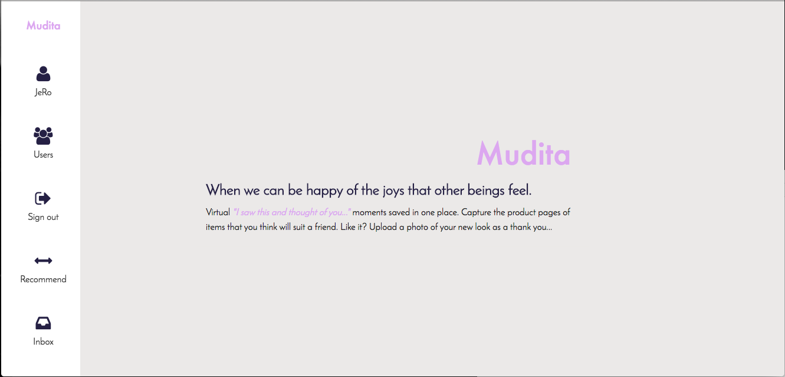
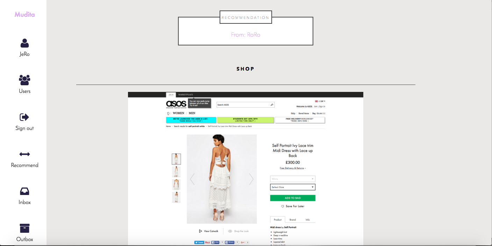
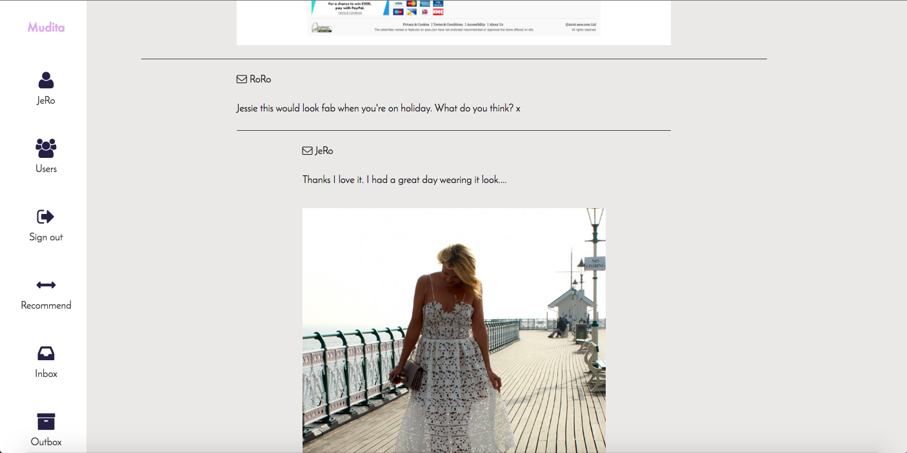
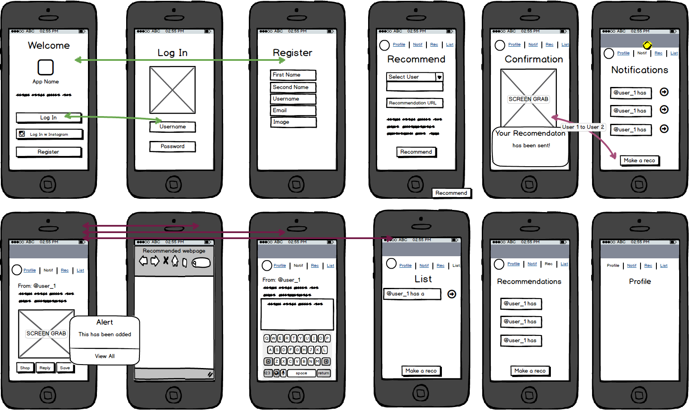
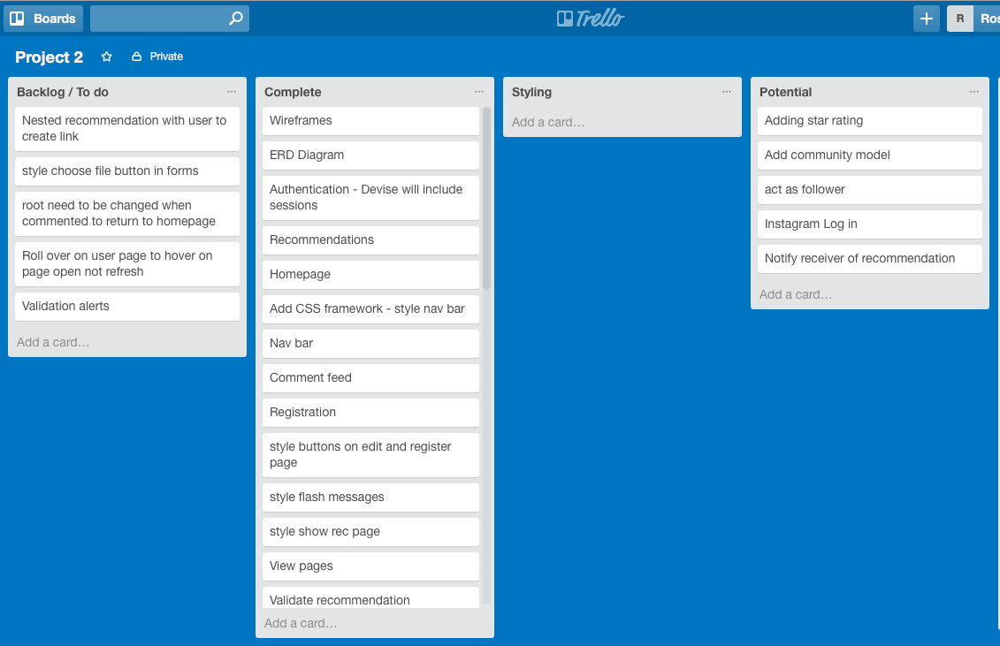

#Mudita

### _"When we can be happy of the joys that other beings feel it is called Mudita"_

[Mudita](https://infinite-falls-99467.herokuapp.com/)

###Introduction
A website that brings a social aspect to shopping online. Allowing you to share links to products you think would suit a friend. 
 Mudia is the "I saw this and thought of you.." moments stored in one place. 

_"When we can be happy of the joys that other beings feel.."_

###How to use
  - Browse online stores, see something. 
  - Log in to Mudita, fill in the recommendation form using the url. 
  - Your friend will recieve a screenshot of the product in their inbox. 
  - They can shop, comment or add a picture of them wearing your recommendation - if they like it. 
  - All comments and photos can only be seen by the sender and receiver of the recommendation. 

###Technologies Used
  - HTML, Sass, Javascript and Rails
  - 
  - Gastly gem - to take a screenshot of the links that a user inputs.
  - Carrierwave - to upload profile photos and a styled shot wearing the recommendation.
 
###Planning tools
Balsamic was used to produce a wireframe

Trello was used to manage tasks and work flow

